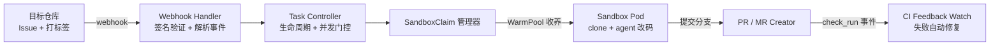

# ai-factory

> 把 GitHub / GitLab 上的 Issue，自动变成一次可控的编码 Agent 执行，最终产出可审查的 Pull Request / Merge Request。

```
Issue → FactoryTask → Sandbox + Agent 改码 → PR/MR → CI 验证 / 自动修复
```

ai-factory 是一个 **Kubernetes 原生的自动化编码流水线系统**。它监听仓库的 Issue，将其封装为声明式的 `FactoryTask`（Kubernetes CRD），在隔离沙箱（Sandbox）中通过 LLM Agent 完成代码变更，再经 CI 验证闭环，自动产出可审查的代码改进。

## 核心特性

- **声明式任务模型** — `FactoryTask` 是 Kubernetes CRD，具备完整的六阶段状态机（Pending → ClaimCreated → SandboxReady → Running → Succeeded / Failed），每个阶段转换记录为 Condition + timestamp + reason

- **自修复闭环** — PR 的 CI 失败自动进入 repair loop：读取错误日志 → 分析原因 → 修复 → force-push → 重检，默认最多 3 轮

- **两种 Agent 引擎** —
  
  - **scripted**（默认）：LLM 三段式产出 shell 脚本，git / commit / PR / CI 由 Go 控制器负责
  - **delegated**：Codex + 可编辑的工作流 skill 自主走完 issue→PR；改 skill 仓库即生效，无需重建镜像

- **热更新** — 配置存于 ConfigMap / Secret，`update-config.sh` 一键同步，无需手工改 Pod

- **幂等性** — 同一任务可重复 reconcile；终态（Succeeded / Failed）后删旧建新，用户重打标签即可重新触发

## 架构总览



ai-factory 由三个镜像协作完成：

| 镜像                         | 职责                                                                            |
| -------------------------- | ----------------------------------------------------------------------------- |
| `ai-factory-server`        | Webhook 服务 + 任务控制器（Go，含 kubectl）                                              |
| `agent-sandbox-controller` | 沙箱生命周期管理：预热池 → 领取 → 执行 → 清理（来自上游 kubernetes-sigs/agent-sandbox）               |
| `coding-agent-sandbox`     | 沙箱开发环境 + `ai-factory-agent`（内置 git / go / node / python3 / codex / gh / glab） |

## 快速开始

需要一台可访问的 K8s 集群（1.24+），`kubectl` 已指向该集群。提供两种部署方式：**GHCR 在线部署**（推荐，无需本地打包）与**离线包部署**（内网 / 无 GHCR 环境）。

### 1. 配置凭证（两种方式通用）

```bash
cp scripts/ai-factory.env.example scripts/ai-factory.env
vim scripts/ai-factory.env
```

| 变量                               | 说明                                            |
| -------------------------------- | --------------------------------------------- |
| `GITHUB_TOKEN`                   | GitHub PAT，`repo` 权限（对应账号需是目标仓库协作者，至少 Triage） |
| `WEBHOOK_SECRET`                 | Webhook 签名密钥                                  |
| `OPENAI_API_KEY`                 | LLM 调用凭证                                      |
| `GITLAB_TOKEN`                   | GitLab PAT，`api, write_repository` 权限         |
| `GIT_PROVIDER`                   | server 实例服务的代码托管方，github / gitlab             |
| `AI_FACTORY_CODEX_PLUGIN_SOURCE` | 委托模式的工作流 skill（Codex 插件源）                     |
| `AI_FACTORY_GIT_PROXY`           | Git 代理（沙箱访问 GitHub/插件市场时配置）                   |

> GitHub 模式最少必填 `GITHUB_TOKEN`、`WEBHOOK_SECRET`、`OPENAI_API_KEY`，外加 `GIT_PROVIDER`。

### 2. 方式 A：在线部署

镜像与 Helm chart 已发布到 `ghcr.io/verdure-oss/`（仓库打 `v*` tag 或手动触发 `.github/workflows/publish.yaml` 后自动推送），因此**无需本地构建镜像**：

```bash
./scripts/deploy-ghcr.sh          # 默认 latest
./scripts/deploy-ghcr.sh v0.1.9    # 指定版本
```

脚本自动完成：安装 FactoryTask 与 agent-sandbox CRD（控制器镜像直接取自 GHCR）→ 从 `ai-factory.env` 加载凭证 → 安装 OCI Helm chart（`oci://ghcr.io/verdure-oss/charts/ai-factory`）→ 等待 rollout。若存在 `scripts/auth.json`，自动挂载 Codex 委托模式认证。

### 3. 方式 B：离线部署

无 GHCR / 内网环境下，用 `package.sh` 本地构建镜像并打包 Helm chart：

```bash
# ① 在开发机打包
./scripts/package.sh
```

`package.sh` 自动构建 3 个镜像并导出为 tar、打包 Helm chart，同时复制 CRD 安装脚本与部署脚本，产物输出到 `dist/`：

```
dist/
├── ai-factory-server.tar          # Webhook 服务 + 任务控制器镜像
├── coding-agent-sandbox.tar       # 沙箱镜像
├── agent-sandbox-controller.tar   # 沙箱控制器镜像
├── ai-factory-*.tgz               # Helm chart
├── components/                    # CRD 安装脚本
├── deploy-remote.sh               # 远程部署脚本
└── ai-factory.env         # 配置模板
```

在服务器上部署（若打包机与服务器不是同一台，先传输：`rsync -avz dist/ user@your-vm:/opt/ai-factory/`）：

```bash
# ② 在服务器上部署
cd /opt/ai-factory/dist/
./deploy-remote.sh
```

`deploy-remote.sh` 自动导入镜像（识别 docker / containerd）→ 安装 FactoryTask 与 agent-sandbox CRD → 修正控制器镜像拉取策略 → 从 `ai-factory.env` 加载凭证（缺失项交互式收集）→ 安装 Helm chart → 等待 rollout。

### 4. 配置 Webhook + 触发（两种方式通用）

服务默认 `NodePort: 32519`；无公网 IP 时改用 Ingress 或 `kubectl port-forward` 暴露。在**目标仓库** `Settings → Webhooks → Add webhook` 配置：

| 配置项          | 值                                                                             |
| ------------ | ----------------------------------------------------------------------------- |
| Payload URL  | `http://<你的服务地址>:32519/webhook/github`/`http://<你的服务地址>:32519/webhook/gitlab` |
| Content type | `application/json`                                                            |
| Secret       | 与 `WEBHOOK_SECRET` 一致                                                         |
| Events       | **Issues**、Check run、Check suites                                             |

给 Issue 打上 `ai-factory` + `ai-factory-run` 标签即触发：ai-factory 自动克隆仓库、在沙箱中让 Agent 修改代码、提交并创建 PR，CI 失败还会自动修复。通过 `running → waiting → running → done` 标签流转可实时观察进度。

> 完整细节（GitLab 部署、Fork PR、CI 修复、两种 Agent 引擎、热更新、卸载回滚等）见下方**文档**。

## 文档

| 文档                                        | 说明                                                               |
| ----------------------------------------- | ---------------------------------------------------------------- |
| [ai-factory指南](docs/self-hosted/guide.md) | ⭐ 完整的中文ai-factory部署 + 使用指南                                       |
| [一般性设置指南](docs/general/guide.md)          | 从其他仓库消费 ai-factory（GitHub Actions + kind / GitLab Runner + kind） |
| [Central AI Factory](docs/central/)       | 中央化共享实例部署相关                                                      |
| [设计文档](docs/superpowers/)                 | 各特性的设计规格（specs）与实施计划（plans）                                      |

## 仓库结构

```
├── factory/              # 核心 Go 代码（CLI / webhook server / 任务控制器 / 代理）
├── components/           # Kubernetes 组件安装 + coding-agent 沙箱镜像
├── charts/ai-factory     # Helm chart（自托管部署）
├── scripts/              # 打包 / 部署 / 配置热更新脚本（update-config.sh）
├── .agents/              # Agent 定义（top-level / speccer / planner / builder / reviewer）
├── docs/                 # 文档与设计规格
├── examples/             # GitHub / GitLab FactoryTask 示例
└── specs/ · plans/       # 规范与执行计划
```

## 开发

```bash
go test ./...
```

提交前请验证 shell 脚本与 YAML 语法；不要在提交中混入 API key、token、生成的 prompt 或任务指令。修改架构决策后请同步更新 `AGENTS.md`。

## License

Apache 2.0。本仓库基于 Google 的 ai-factory 实验项目 fork 而来，**不是 Google 官方支持的产品**。
