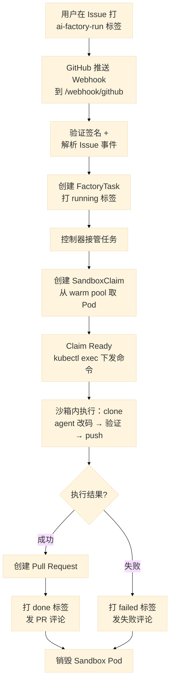
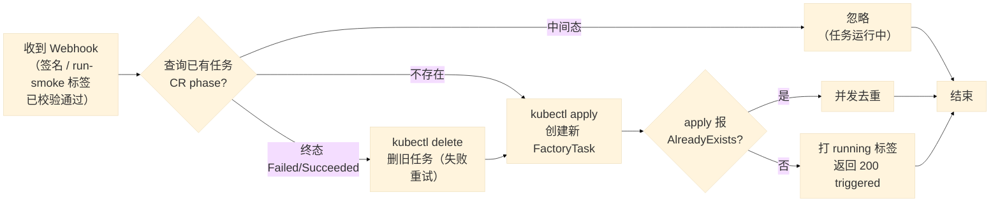
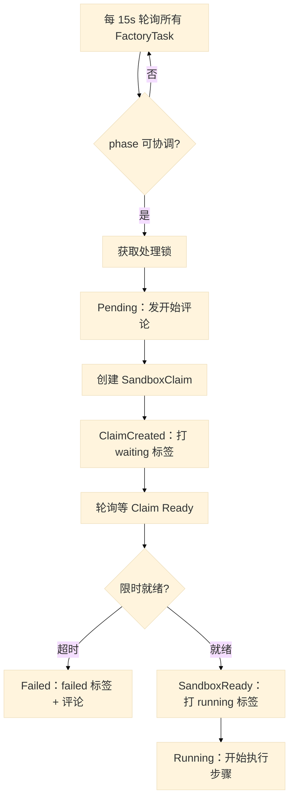
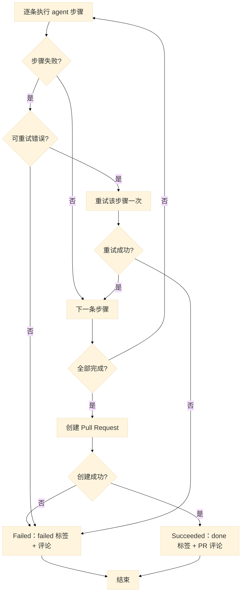
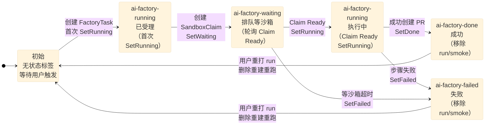
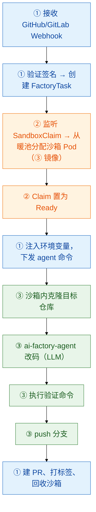
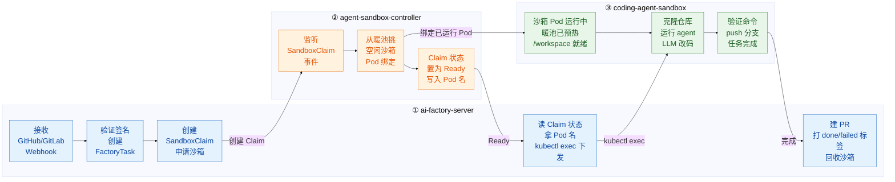

# ai-factory 自托管服务汇报流程图

> 本文档包含 ai-factory 自托管服务的 7 幅 Mermaid 流程图，用于进度汇报。
> Mermaid 可直接在 GitHub、Typora、VS Code 等支持渲染的 Markdown 阅读器中显示。
> 每幅图控制在单屏内可完整截取，节点文案已精简，详细说明见 `docs/` 下的设计文档。

## 目录

1. [整体端到端流程](#1-整体端到端流程)
2. [Webhook 处理流程](#2-webhook-处理流程)
3. [控制器调度与沙箱准备](#3-控制器调度与沙箱准备)
4. [控制器执行与收尾](#4-控制器执行与收尾)
5. [标签状态机](#5-标签状态机)
6. [三个镜像的协作](#6-三个镜像的协作)
7. [三个镜像的泳道协作](#7-三个镜像的泳道协作)

---

## 1. 整体端到端流程

**一句话说明**：$从"用户给 Issue 打标签"到"自动生成 PR"的完整链路，是汇报的主图。$

---

## 2. Webhook 处理流程

**一句话说明**：只讲两个核心机制——**终态删除重建（失败重试）**：任务名确定，CR 到终态（Failed/Succeeded）时删旧建新即可重跑；**AlreadyExists 并发去重**：同名任务只建一个，并发 apply 的输家视为成功。前置的签名、标签校验流程已省略。

---

## 3. 控制器调度与沙箱准备

**一句话说明**：控制器把任务从"等待"推进到"沙箱就绪"，含 waiting↔running 标签切换。

---

## 4. 控制器执行与收尾

**一句话说明**：在沙箱内执行 agent 步骤、失败重试、创建 PR 并收尾。因节点较多，从原"控制器执行流程"拆为两幅，保证单屏可完整显示。

---

## 5. 标签状态机

**一句话说明**：用户通过标签实时看到任务卡在哪——`running`(已受理) → `waiting`(等沙箱) → `running`(执行中) → `done`/`failed`。注意 **`running` 出现两次但含义不同**；到 `done`/`failed` 时系统会**移除触发标签 `run`/`smoke`**，用户重打即可删除重建、重新执行。

---

## 6. 三个镜像的协作

**一句话说明**：自托管服务打包后产出 **3 个镜像**，编号 + 颜色标识每个环节由哪个镜像负责，镜像明细见下方表格。

**三个镜像**（对应 `scripts/package.sh` 产出的 3 个 tar 包）：

| 编号  | 镜像                         | 来源                               | 职责                                |
| --- | -------------------------- | -------------------------------- | --------------------------------- |
| ①   | `ai-factory-server`        | 自研                               | Webhook 服务 + 任务控制器（Go，含 kubectl）  |
| ②   | `agent-sandbox-controller` | 上游 kubernetes-sigs/agent-sandbox | SandboxClaim / 暖池控制器              |
| ③   | `coding-agent-sandbox`     | 自研                               | 沙箱开发环境 + ai-factory-agent（Python） |

---

## 7. 三个镜像的泳道协作

**一句话说明**：上一幅按"环节先后"讲，这幅按"职责划分"讲——每个镜像一个泳道（subgraph），跨块箭头即协作点。① server 放中间作为编排中心，②③ 分列左右，跨块箭头最少。交接机制：server 不直连 Pod，靠 kubectl 读 SandboxClaim 状态拿 Pod 名，再 `kubectl exec` 进沙箱执行命令；暖池已把 Pod 预热为 Running（/workspace 就绪），任务无需等待冷启动。

---

## 标签对照表（附）

| 标签                   | 颜色   | 含义        | 谁添加 | 何时移除    |
| -------------------- | ---- | --------- | --- | ------- |
| `ai-factory-run`     | 用户定义 | 触发正式执行    | 用户  | 任务完成/失败 |
| `ai-factory-smoke`   | 用户定义 | 触发冒烟测试    | 用户  | 任务完成/失败 |
| `ai-factory-running` | 蓝    | 执行中       | 系统  | 状态切换    |
| `ai-factory-waiting` | 黄    | 排队等沙箱 Pod | 系统  | 状态切换    |
| `ai-factory-done`    | 绿    | 成功        | 系统  | 重新触发时   |
| `ai-factory-failed`  | 红    | 失败        | 系统  | 重新触发时   |
