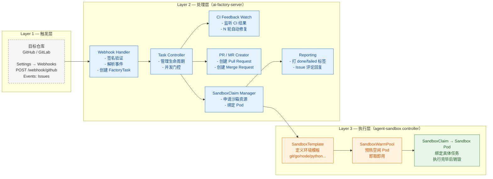

# ai-factory 指南

## 一、概述

### 1.1 ai-factory 是什么

ai-factory 是一个 **Kubernetes 原生的自动化编码流水线系统**。它监听 GitHub / GitLab 的 Issue，将其转为声明式的 `FactoryTask` 资源，在隔离沙箱中通过 LLM Agent 完成代码变更，再通过 CI 验证闭环自动产出可审查的代码改进：

```
Issue → FactoryTask → Sandbox + Agent 改码 → PR/MR → CI 验证/自动修复
```

**具体流程：**

1. 有人在 GitHub / GitLab 上创建一个 Issue，描述想要实现的功能或要修复的 bug
2. ai-factory 监听到这个 Issue，将其封装为一个 `FactoryTask`（Kubernetes CRD）
3. 在隔离沙箱（Sandbox Pod）中克隆目标仓库、基于 base 分支新建工作分支
4. 运行编码 agent，将 issue 内容作为 prompt 传入，agent 生成代码并提交到工作分支
5. 推送工作分支并自动创建 Pull Request / Merge Request
6. 通过 CI webhook 监听 PR 的构建状态，成功时打 `done` 标签，失败时自动触发 repair loop 修复后重新提交

**关键设计原则：**

**核心原则：**

- **声明式任务模型** — `FactoryTask` 是 Kubernetes CRD，有完整的六阶段状态机（Pending → ClaimCreated → SandboxReady → Running → Succeeded / Failed），每个阶段转换都记录为 Condition + timestamp + reason
- **提供商中立** — 支持任何 OpenAI-compatible API，通过 `OPENAI_BASE_URL` 切换，不绑定特定厂商
- **Kubernetes 原生** — CRD + Controller Pattern，可部署在任何 K8s 集群（kind / GKE / EKS / 自建）
- **幂等性** — 同一个 FactoryTask 可重复 reconcile；并发 apply 报 `AlreadyExists` 时输家视为成功；终态（Failed / Succeeded）后删旧建新，用户重打标签即可重新触发
- **自修复闭环** — CI 失败自动进入 repair loop，agent 读取错误日志 → 分析原因 → 修复代码 → force-push → CI 重检，默认最多 3 轮（`server.ciWatchMaxRetries: 3`）
- **Provider-neutral 执行计划** — `ExecutionPlan` 从 FactoryTask spec 转换为统一的 shell 脚本序列（clone → checkout → agent → commit → push），同时适配 GitHub 和 GitLab
- **两种操作模式** — `run`（完整 agent 流程：改码 + 验证 + 创建 PR）和 `smoke`（仅验证工具链，不改代码）
- **热更新** — 配置存在 ConfigMap/Secret 中，通过 volume 注入 Pod，修改 env 文件后无需重启即可生效
- **任务重试** — 任务达到终态（Failed / Succeeded）后删旧建新，用户重打标签即可重新触发

### 1.2 实现思路

ai-factory 的运行思路如下：

| 维度    | 实现方式                     | 说明                                    |
| ----- | ------------------------ | ------------------------------------- |
| 触发方式  | Issue 打标签 → Webhook POST | GitHub/GitLab 推送事件到 `/webhook/github` |
| 基础设施  | K8s 常驻 Deployment        | 零冷启动，服务始终运行                           |
| 新仓库接入 | 只配一个 Webhook             | ai-factory 侧零改动                       |
| 凭证管理  | 集中在服务端 K8s Secret        | GitHub Token、OpenAI Key 等统一管理         |
| 沙箱预热  | WarmPool 预热空闲 Pod        | 任务触发后秒级响应                             |
| 资源成本  | 常驻但有固定成本                 | 多仓库摊薄，比按分钟计费更划算                       |

**核心优势：**

- **零冷启动**：基础设施常驻 K8s 集群，Sandbox WarmPool 预热空闲 Pod，任务触发后秒级响应
- **统一接入**：新增仓库只需添加 Webhook 指向服务端，ai-factory 侧无需任何修改
- **凭证收敛**：所有凭证（GitHub Token、OpenAI Key 等）集中在服务端 K8s Secret，不分散在各仓库
- **可扩展性**：通过 WarmPool 和并发门控，可支撑多仓库高并发场景，多仓库资源成本摊薄

### 1.3 服务架构

ai-factory 服务整体分为三层：




#### 三个层次的职责

| 层次      | 组件                                  | 职责                                      |
| ------- | ----------------------------------- | --------------------------------------- |
| **触发层** | Webhook Handler                     | 验证签名、解析 issue payload、根据 label 决定是否创建任务 |
| **处理层** | Controller Loop + CI Feedback Watch | 拉取 FactoryTask、并发门控、监听 CI 结果自动 repair   |
| **执行层** | agent-sandbox controller            | 管理 Sandbox 生命周期：预热池 → 领取 → 执行 → 清理      |

#### 三个镜像的协作

ai-factory 打包后产出 3 个镜像，每个环节由对应的镜像负责：

| 编号  | 镜像                         | 来源                               | 职责                                       |
| --- | -------------------------- | -------------------------------- | ---------------------------------------- |
| ①   | `ai-factory-server`        | ai-factory 项目                    | Webhook 服务 + 任务控制器（Go，含 kubectl）         |
| ②   | `agent-sandbox-controller` | 上游 kubernetes-sigs/agent-sandbox | SandboxClaim / 暖池控制器                     |
| ③   | `coding-agent-sandbox`     | ai-factory 项目                    | 沙箱开发环境 + ai-factory-agent（Python 调用 LLM） |

**协作流程图：**


---

## 二、部署指南

### 2.1 前置条件

| 项目            | 要求                            |
| ------------- | ----------------------------- |
| Kubernetes 集群 | 1.24+，≥ 2 节点（推荐 3+），2C4G+     |
| kubectl       | 已配置当前上下文                      |
| Helm          | 3.x                           |
| 容器运行时         | Docker 或 nerdctl + buildkit   |
| 网络            | 能访问 GitHub API 和 LLM endpoint |

支持的集群类型：kind、minikube、GKE / EKS / AKS、自建集群。

**网络要求补充**：

- 能访问 GitHub（克隆 agent-sandbox 仓库，构建时需要）

### 2.2 快速部署（推荐路径）

#### Step 1：构建镜像包

在开发机器上运行：

```bash
./scripts/package.sh
```

脚本会自动完成：

1. 检测容器构建工具（优先 nerdctl+buildkit，其次 docker）
2. 自动检测本地代理（常见端口：7890、1080、8080、3128）
3. 构建 3 个镜像并导出为 tar
4. 打包 Helm chart
5. 复制部署脚本、CRD 安装脚本、配置模板

输出目录结构：

```
dist/
├── ai-factory-server.tar                  # Server 镜像 (~87MB)
├── coding-agent-sandbox.tar               # Sandbox 镜像 (~622MB)
├── agent-sandbox-controller.tar           # 控制器镜像 (~16MB)
├── ai-factory-*.tgz                       # Helm chart
├── components/                            # CRD 安装脚本
├── deploy-remote.sh                       # 远程部署脚本
└── ai-factory.env                         # 配置模板
```

#### Step 2：传输到目标机器

```bash
# scp
scp -r dist/ user@your-vm:/opt/ai-factory/

# 或 rsync（推荐，支持断点续传）
rsync -avz --progress dist/ user@your-vm:/opt/ai-factory/dist/
```

#### Step 3：一键部署

```bash
ssh user@your-vm
cd /opt/ai-factory/dist/

# 编辑配置文件（填入真实的 token、secret 等值）
vim ai-factory.env

# 运行部署（自动从 ai-factory.env 加载配置，跳过交互式输入）
./deploy-remote.sh
```

部署脚本会自动完成：

1. 检查 kubectl 和集群连接
2. 导入镜像（自动识别 docker / containerd / cri 运行时）
3. 如果是 kind 集群，自动加载镜像到 kind
4. 安装 FactoryTask CRD 和 agent-sandbox CRD（含 namespace、RBAC）
5. 修正 agent-sandbox 控制器镜像拉取策略（离线环境强制 `imagePullPolicy=IfNotPresent`）
6. 从 `ai-factory.env` 加载凭证配置（缺失项交互式收集）
7. 安装 Helm chart 并等待 rollout

预计总耗时：5-15 分钟（取决于网络和镜像大小）。

**终端输出示例：**

```
=== ai-factory 远程部署脚本 ===

✓ K8s 集群连接正常

1. 导入镜像...
   检测到容器运行时: containerd
   ✓ ai-factory-server
   ✓ coding-agent-sandbox
   ✓ agent-sandbox-controller

2. 安装 CRD...
   ✓ FactoryTask CRD
   ✓ agent-sandbox CRD

2.1 修正 agent-sandbox 控制器镜像拉取策略...
   ✓ agent-sandbox 控制器 imagePullPolicy=IfNotPresent

3. 配置凭证...
   从 /opt/ai-factory/dist/ai-factory.env 加载配置...
   ✓ 已加载

4. 安装 Helm chart...
   Release "ai-factory" does not exist. Installing it now.
   NAME: ai-factory
   STATUS: deployed
   REVISION: 1

5. 等待部署完成...
   Deployment successfully rolled out
   ✓ ai-factory-server 已就绪

5.1 等待 agent-sandbox 控制器...
   ✓ agent-sandbox 控制器已就绪

=== 部署完成 ===

Pod 状态:
NAME                                  READY   STATUS    RESTARTS   AGE
ai-factory-server-xxxxxxxxxx-xxxxx    1/1     Running   0          30s

Warm Pool 状态:
NAME                    READY   AGE
coding-agent-warm-pool  2/2     30s

下一步:
  1. 暴露服务: kubectl port-forward --address=0.0.0.0 svc/ai-factory-server 8080:80 -n ai-factory
  2. 配置 GitHub webhook: http://your-vm-ip:32519/webhook/github
  3. 给 issue 打标签触发: ai-factory-run → 完整 agent 流程
```

### 2.3 密钥一览

存储在 K8s Secret `ai-factory-secrets` 中：

| Key              | 用途                 | 必需           |
| ---------------- | ------------------ | ------------ |
| `GITHUB_TOKEN`   | GitHub PAT，repo 权限 | ✅（GitHub 模式） |
| `WEBHOOK_SECRET` | HMAC-SHA256 签名密钥   | ✅            |
| `OPENAI_API_KEY` | LLM 调用凭证           | ✅            |
| `CODEX_API_KEY`  | Codex CLI 密钥       | 可选           |

> **`GITHUB_TOKEN` 获取方式**：GitHub → Settings → Developer settings → Personal access tokens → Tokens(classic) → Generate new token → 勾选 `repo public_repo` 权限。
> 
> > 注意：token 只是"凭证"，对应的 GitHub 账号还需拥有目标仓库的协作者权限（至少 Triage）。自有仓库无需额外操作；公共/他人仓库需要将机器人账号添加为 collaborator。

### 2.4 Helm Chart 核心参数速查

| 参数路径                        | 默认值        | 说明                    |
| --------------------------- | ---------- | --------------------- |
| `server.maxConcurrentTasks` | `2`        | 最大并发任务数               |
| `server.watchInterval`      | `15s`      | Controller 轮询间隔       |
| `server.taskTimeout`        | `30m`      | SandboxClaim 就绪超时     |
| `server.ciWatchEnabled`     | `true`     | 启用 CI feedback repair |
| `server.ciWatchMaxRetries`  | `3`        | CI 修复最大轮数             |
| `sandbox.warmPoolReplicas`  | `2`        | 预热沙箱副本数               |
| `service.type`              | `NodePort` | 服务暴露方式                |
| `service.nodePort`          | `32519`    | NodePort 端口号          |

### 2.5 配置 Webhook

Webhook 需要在**目标仓库**上配置（ai-factory 处理的仓库），分两步：

#### 1. 配置目标仓库权限

要让 ai-factory 在目标仓库上正常工作，需要两步权限准备：

**① 添加 Webhook 需要 Admin 权限** — 只有仓库的 Admin（或 owner）能在 `Settings → Webhooks` 添加 webhook。

**② 机器人账号需要至少 Triage 权限** — ai-factory 用 `GITHUB_TOKEN` 对应的账号执行：读取 Issue、给 Issue 打状态标签、回帖评论。这些操作要求该账号被添加为目标仓库的协作者，并授予至少 **Triage** 权限：

| 权限     | 能做什么                        | 是否满足 ai-factory |
| ------ | --------------------------- | --------------- |
| Read   | 读仓库、开/评论 Issue              | ❌               |
| Triage | Read + 管理 Issue 标签、关闭 Issue | ✅ 最低要求          |
| Write  | Triage + 直接推分支、建 PR         | ✅ 直推时需要         |
| Admin  | Write + 管理 Webhook          | ✅               |

添加方式：目标仓库 → `Settings → Collaborators and teams → Add people` → 输入机器人账号 → 选择对应权限。

> **Fork 场景**：向公共仓库提 PR 时，上游只需 **Triage**（用于评论/打标签/读）；PR 通过自己的 fork 提交，不需要上游 Write。

#### 2. 在目标仓库配置 Webhook

在目标仓库 `Settings → Webhooks → Add webhook` 填写：

| 配置项          | 值                                         |
| ------------ | ----------------------------------------- |
| Payload URL  | `http://your-service/webhook/github`      |
| Content type | `application/json`                        |
| Secret       | 部署时设置的 `WEBHOOK_SECRET`                   |
| Events       | **Issues**、**Check run**、**Check suites** |

> ⚠️ **重要：Events 必须选 "Issues"，不要选 "Labels"**
> 
> - **"Issues"** 事件会推送 issue 生命周期（含 `labeled` 打标签动作），服务端只响应 `labeled`，其余 action 静默忽略
> - **"Labels"** 事件只在"标签本身被创建/编辑/删除"时触发，且 payload **不含 issue 信息**，服务端无法据此创建任务
> 
> **触发方式**：先创建 Issue，打上`ai-factory`、 `ai-factory-run` 标签触发ai-factory 工作。

### 2.6 暴露服务供 Webhook 调用

如果你的 VM 没有公网 IP，GitHub 无法直接访问，需要以下方案之一：

| 方案           | 公网 IP | HTTPS | 适合场景   |
| ------------ | ----- | ----- | ------ |
| **NodePort** | ✅     | ❌     | 有云服务器时 |
| **Ingress**  | ✅     | ✅     | 生产环境推荐 |

### 2.7 热更新配置

以下配置修改后**无需重启 Pod**，Controller 下次轮询自动生效：

- `MAX_CONCURRENT_TASKS` — 动态扩缩并发
- `CI_WATCH_MAX_RETRIES` — 调整 repair 重试上限
- `CI_WATCH_ENABLED` — 随时开关 CI feedback
- `OPENAI_*` — 切换模型参数

```bash
# 编辑配置文件
vim ai-factory.env

# 同步到集群（~30s 后生效）
./scripts/update-config.sh
```

### 2.8 卸载 / 回滚

```bash
# 卸载 Helm release（保留 namespace 和 CRD）
helm uninstall ai-factory -n ai-factory

# 删除 namespace（移除全部资源）
kubectl delete namespace ai-factory

# 如需清理 FactoryTask CRD
kubectl delete crd factorytasks.factory.ai.gke.io
```

---

## 三、实例与最佳实践

### 3.1 完整端到端流程

任务开始阶段


任务完成阶段


**一句话**：从"用户给 Issue 打标签"到"自动生成 PR"的完整链路：

```
用户打标签 → GitHub 推送 Webhook → 验证签名 + 解析事件 → 创建 FactoryTask
  → 控制器创建 SandboxClaim → 从 warm pool 取 Pod → 沙箱内 clone + agent 改码 + push
  → 自动创建 PR → 通过 CI webhook 监听结果 → 失败则 repair loop 修复后 re-push → 成功时打 done 标签并销毁沙箱
```

### 3.2 标签状态机

通过标签用户可以实时看到任务卡在哪一步。`running` 出现两次但含义不同：第一次表示已受理，第二次表示执行中。到 `done`/`failed` 时系统会移除触发标签 `run`/`smoke`，用户重打即可重新执行。

| 标签                   | 含义    | 谁添加 | 何时移除        |
| -------------------- | ----- | --- | ----------- |
| `ai-factory-run`     | 正式运行  | 用户  | 任务完成/失败     |
| `ai-factory-smoke`   | 冒烟测试  | 用户  | 任务完成/失败     |
| `ai-factory-running` | 执行中   | 系统  | 状态切换时       |
| `ai-factory-waiting` | 排队等沙箱 | 系统  | Claim Ready |
| `ai-factory-done`    | 成功    | 系统  | 重新触发时       |
| `ai-factory-failed`  | 失败    | 系统  | 重新触发时       |

**标签流转示例：**

```
初始状态                                                      ← Issue 创建
   ↓ 用户打 ai-factory-run 标签
ai-factory-running                                          ← 已受理，开始处理
   ↓ 正在分配沙箱
ai-factory-waiting                                          ← 排队等沙箱 Pod 就绪
   ↓ 沙箱就绪
ai-factory-running                                          ← 执行中（agent 改码）
   ↓ Agent 完成 + PR 创建
ai-factory-done                                             ← 成功，PR 已创建
```


### 3.3 Smoke Test

仅加 `ai-factory-smoke` 标签：Agent 不会修改代码，只在 sandbox 里验证工具链是否就位（git、go、node、python3 等）。

**适用场景：** 新仓库首次接入时自检环境，或者确认 sandbox 镜像是否正常。

### 3.4 CI Feedback Repair（亮点功能）

PR merged 后，controller 通过 `check_run` webhook 自动监听 CI 结果。如果 CI 失败，自动修复 → re-push → 重检，形成一个闭环：

```
PR 推送 → CI 运行
         ↓ CI 失败？
      Agent 读取错误日志 → 分析原因
         ↓
      自动修复代码 → force-push → CI 重检
         ↓ (循环直到 CI 通过 或 达到 maxRetries)
      最终 verdict 写入 task 状态
```

**控制参数：**

- `server.ciWatchEnabled: true` — 开关
- `server.ciWatchMaxRetries: 3` — 最大修复轮数

> 

### 3.5 Fork 工作流（向公共仓库提 PR）

**默认行为：**

- 当 `GITHUB_TOKEN` 对应的 GitHub 账号（比如 `alice`）不是事件仓库的 owner（比如 `myorg/myrepo`）时，ai-factory 会自动使用 fork 流程
- 系统会自动调用 GitHub API 从 token 反查登录名，作为 fork owner
- **不需要手动配置 `GITHUB_FORK_OWNER`**

**配置方式（可选）：**

如果需要显式指定 fork owner（比如使用专门的机器人账号），可以在 `ai-factory.env` 中设置：

```
GITHUB_FORK_OWNER=myusername              # fork 的所有者用户名
GITHUB_REPOSITORY_ALLOWLIST=myorg/myrepo  # 可选：允许触发的仓库白名单
```

**行为：**

```
1. 接收 myorg/myrepo 的 Issue 事件
2. 自动克隆 myusername/myrepo（fork）
3. git fetch upstream && 基于上游最新分支建分支
4. 改代码、提交
5. 推分支到自己的 fork
6. 创建 PR: myusername:branch → myorg/myrepo:base
```

**场景示例：**

| 配置                      | 事件仓库           | 行为                                |
| ----------------------- | -------------- | --------------------------------- |
| 无配置（token 属 `alice`）    | `alice/myrepo` | 直推，不需要 fork                       |
| 无配置（token 属 `alice`）    | `myorg/myrepo` | 自动 fork → 创建 PR 指向 `myorg/myrepo` |
| `GITHUB_FORK_OWNER=bob` | `myorg/myrepo` | 使用 `bob/myrepo` 作为 fork，创建 PR     |
| `GITHUB_FORK_OWNER=bob` | `bob/myrepo`   | 直推（owner 相同，不需要 fork）             |

### 3.6 GitLab 集成

GitLab 与 GitHub **分开部署**：一个 server 实例只服务一个提供商，由 `GIT_PROVIDER` 环境变量指定（**必填**，值为 `github` 或 `gitlab`；不设置则启动即报错）。服务只挂载对应的 webhook 端点，另一个端点返回 404，从物理上杜绝误触发。

#### 部署拓扑

ai-factory 干活时是**主动连接** GitLab 的（clone / push / 建 MR / issue 回帖），因此 GitLab 模式的 server 必须部署在**能访问 GitLab 的内网**。自建 GitLab 无需公网入口——它只需能把 webhook 推给内网的 ai-factory，并被 ai-factory 反向访问。

| 交互 | 方向 | 说明 |
| --- | --- | --- |
| Issue 打标签推 webhook | GitLab → ai-factory | 内网互通即可 |
| clone / push / 建 MR / 回帖 | ai-factory → GitLab | 内网互通即可 |
| 调用 LLM | ai-factory → 公网 | 需要出网能力 |

#### 配置步骤

1. **配置凭证**：`ai-factory.env` 中设置

   ```
   GIT_PROVIDER=gitlab
   GITLAB_TOKEN=<Personal Access Token>   # 需要 api 权限
   GITLAB_API_BASE=                       # 可选，见下
   ```

   自建实例的 API 基址默认从项目 host 自动推导为 `https://<host>/api/v4`。仅当需要覆盖（例如反向代理改写了路径）时才设置 `GITLAB_API_BASE`，注意**必须包含 `/api/v4` 后缀**。

2. **配置 Webhook**：目标 GitLab 项目 → `Settings → Webhooks → Add new webhook`

   | 配置项 | 值 |
   | --- | --- |
   | URL | `http://<ai-factory-内网地址>/webhook/gitlab` |
   | Secret token | 部署时设置的 `WEBHOOK_SECRET` |
   | Trigger | 仅勾选 **Work item events** |

   > **只勾 Work item events**（旧版 UI 叫 "Issues events"）。它对应 GitHub 的 "Issues" 事件，涵盖 issue 的创建/更新/关闭/重开，其中包含标签变更。其余事件（Comments、Merge request events 等）都不需要。

3. **触发**：给 issue 打上 `ai-factory` + `ai-factory-run` 标签。体验与 GitHub 完全一致——`running` / `waiting` / `done` / `failed` 状态标签实时反馈、移除触发标签可取消排队中的任务、自动创建 MR、issue 回帖汇报结果。

#### 与 GitHub 的差异（已由 ai-factory 内部消化）

GitHub 的 "Issues" 事件在加标签时 `action=labeled`，payload 直接带上刚加的标签；**GitLab 没有独立的 labeled 动作**，加/删标签都归入 `action=update`，标签变化放在 `changes.labels.{previous,current}` 里。ai-factory 会自动计算差集还原出"刚加/刚删的触发标签"，归一化成与 GitHub 相同的模型，用户无感知。

#### 暂不支持

- **CI 失败自动修复**：GitLab pipeline 监听尚未实现（GitHub 的 Actions check 已支持）。GitLab 任务建完 MR 即视为成功。
- **Fork 工作流**：`GITHUB_FORK_OWNER` 仅对 GitHub 生效。

### 3.7 常用命令

```bash
NAMESPACE=ai-factory

# 查看 server 健康状态
kubectl get pods -n $NAMESPACE

# 查看 Warm Pool
kubectl get sandboxwarmpool -n $NAMESPACE

# 查看所有任务
kubectl get factorytasks -n $NAMESPACE

# 实时日志
kubectl logs -f deployment/ai-factory-server -n $NAMESPACE --tail=50

# 查看详细事件（任务挂起时）
kubectl describe factorytask <name> -n $NAMESPACE

# 端口转发（本地调试）
kubectl port-forward svc/ai-factory-server 8080:80 -n $NAMESPACE &
curl http://localhost:8080/healthz  # 应返回 ok
```

---
