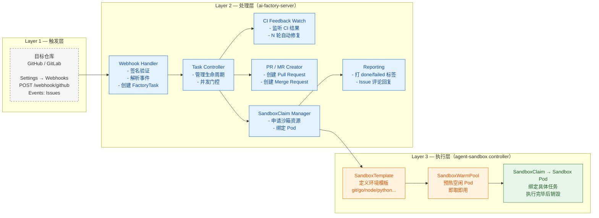

# ai-factory 指南

## 一、概述

### 1.1 ai-factory 是什么

ai-factory 是一个 **Kubernetes 原生的自动化编码流水线系统**。它监听 GitHub / GitLab 的 Issue，将其转为声明式的 `FactoryTask` 资源，在隔离沙箱中通过 LLM Agent 完成代码变更，再通过 CI 验证闭环自动产出可审查的代码改进：

```
Issue → FactoryTask → Sandbox + Agent 改码 → PR/MR → CI 验证/自动修复
```

**具体流程：**

1. 有人在 GitHub / GitLab 上创建一个 Issue，描述想要实现的功能或要修复的 bug
2. ai-factory 监听到这个 Issue，将其封装为一个 `FactoryTask`（Kubernetes CRD）
3. 在隔离沙箱（Sandbox Pod）中克隆目标仓库、基于 base 分支新建工作分支
4. 运行编码 agent，将 issue 内容作为 prompt 传入，agent 生成代码并提交到工作分支
5. 推送工作分支并自动创建 Pull Request / Merge Request
6. 通过 CI webhook 监听 PR 的构建状态，成功时打 `done` 标签，失败时自动触发 repair loop 修复后重新提交

**关键设计原则：**

**核心原则：**

- **声明式任务模型** — `FactoryTask` 是 Kubernetes CRD，有完整的六阶段状态机（Pending → ClaimCreated → SandboxReady → Running → Succeeded / Failed），每个阶段转换都记录为 Condition + timestamp + reason

- **自修复闭环** — CI 失败自动进入 repair loop，agent 读取错误日志 → 分析原因 → 修复代码 → force-push → CI 重检，默认最多 3 轮（`server.ciWatchMaxRetries: 3`）

- **统一执行计划** — 从 FactoryTask spec 转换为统一的步骤序列（clean → clone → checkout → agent → commit → push），通过沙箱统一执行，同时适配 GitHub 和 GitLab

- **两种 Agent 引擎** — `scripted`（默认：LLM 三段式产出 shell 脚本，git/PR/CI 由 Go 控制器负责）和 `delegated`（Codex + 可编辑的 workflow skill 自主走完 issue→PR，控制器退化为瘦启动器）；通过 `AGENT_COMMAND` 选择（见 2.9）

- **热更新** — 配置存在 ConfigMap/Secret 中，通过 volume 注入 Pod，修改 env 文件后无需重启即可生效

- **任务重试** — 任务达到终态（Failed / Succeeded）后删旧建新，用户重打标签即可重新触发

### 1.2 实现思路

ai-factory 的运行思路如下：

| 维度    | 实现方式                     | 说明                                                        |
| ----- | ------------------------ | --------------------------------------------------------- |
| 触发方式  | Issue 打标签 → Webhook POST | GitHub/GitLab 推送事件到 `/webhook/github` / `/webhook/gitlab` |
| 基础设施  | K8s 常驻 Deployment        | 零冷启动，服务始终运行                                               |
| 新仓库接入 | 只配一个 Webhook             | ai-factory 侧零改动                                           |
| 凭证管理  | 集中在服务端 K8s Secret        | GitHub Token、OpenAI Key 等统一管理                             |
| 沙箱预热  | WarmPool 预热空闲 Pod        | 任务触发后秒级响应                                                 |
| 资源成本  | 常驻但有固定成本                 | 多仓库摊薄，比按分钟计费更划算                                           |

**核心优势：**

- **零冷启动**：基础设施常驻 K8s 集群，Sandbox WarmPool 预热空闲 Pod，任务触发后秒级响应
- **统一接入**：新增仓库只需添加 Webhook 指向服务端，ai-factory 侧无需任何修改
- **凭证收敛**：所有凭证（GitHub Token、OpenAI Key 等）集中在服务端 K8s Secret，不分散在各仓库
- **可扩展性**：通过 WarmPool 和并发门控，可支撑多仓库高并发场景，多仓库资源成本摊薄

### 1.3 服务架构

ai-factory 服务整体分为三层：




#### 三个层次的职责

| 层次      | 组件                                  | 职责                                      |
| ------- | ----------------------------------- | --------------------------------------- |
| **触发层** | Webhook Handler                     | 验证签名、解析 issue payload、根据 label 决定是否创建任务 |
| **处理层** | Controller Loop + CI Feedback Watch | 拉取 FactoryTask、并发门控、监听 CI 结果自动 repair   |
| **执行层** | agent-sandbox controller            | 管理 Sandbox 生命周期：预热池 → 领取 → 执行 → 清理      |

#### 三个镜像的协作

ai-factory 打包后产出 3 个镜像，每个环节由对应的镜像负责：

| 编号  | 镜像                         | 来源                               | 职责                                                                                                                                    |
| --- | -------------------------- | -------------------------------- | ------------------------------------------------------------------------------------------------------------------------------------- |
| ①   | `ai-factory-server`        | ai-factory 项目                    | Webhook 服务 + 任务控制器（Go，含 kubectl）                                                                                                      |
| ②   | `agent-sandbox-controller` | 上游 kubernetes-sigs/agent-sandbox | SandboxClaim / 暖池控制器                                                                                                                  |
| ③   | `coding-agent-sandbox`     | ai-factory 项目                    | 沙箱开发环境 + `ai-factory-agent`（scripted 模式用 Python 调 LLM；delegated 模式用预装的 Codex CLI）。镜像内置 git/go/node/python3、`gh`、`glab`、`codex`，两种模式共用 |

> 说明：v0.1.8+ 的 sandbox 镜像**默认预装 Codex CLI**（`INSTALL_CODEX_CLI` 已不再需要显式开启）以及 `gh` / `glab`。即使只使用 `scripted` 模式，这些 CLI 也会随镜像一并构建。

**协作流程图：**


### 1.4 Codex 插件体系（委托模式的工作流 skill）

delegated 模式（见 §2.9）的"剧本"由独立插件仓 `Verdure-oss/ai-factory-codex-plugins` 承载与分发。沙箱里的 `ai-factory-agent codex` 会在**每个任务开始时**自动注册市场并安装最新插件。

插件内含 **3 个 skill**，一个任务里按"编排 → 执行 → 审查"协作：

```
issue-fix（编排者）
   │  规划任务、理解 issue
   ├─→ 派发 builder：实现最小正确改动 + 本地校验
   ├─→ 派发 reviewer：审查 diff → APPROVE / REQUEST_CHANGES
   └─  汇总后自行 commit → push → 开 PR/MR
```

| Skill       | 角色  | 职责                                           |
| ----------- | --- | -------------------------------------------- |
| `issue-fix` | 编排者 | 总控流程：规划 → 派发 builder / reviewer → 提交推送、开变更请求 |
| `builder`   | 执行者 | 被派发：实现最小改动并本地校验                              |
| `reviewer`  | 审查者 | 被派发：审查 diff，给出 APPROVE / REQUEST_CHANGES     |

**设计动机 —— 引擎与流程分层**：

- **引擎与流程解耦**：引擎（怎么起 Codex）与流程（做哪些步骤）彻底分开。skill 是外部可加载、可随时改的 markdown —— 改 skill 只需改插件仓再 push，**不动 Go 代码、不重建镜像**。
- **skill 可按角色拆成子 skill，流程中按需加载**：把一套流程拆成编排（`issue-fix`）、执行（`builder`）、审查（`reviewer`）等独立 skill。每个 skill 用 front-matter 的 `description` 声明"何时适用"，Codex 在**对应阶段才加载对应角色** —— 例如先加载编排 skill 规划任务，再在实现阶段加载 builder、审查阶段加载 reviewer。相比一份超大单体 skill，角色拆分让每步指令更聚焦、各角色可独立迭代，改一个角色不影响其他流程。

---

## 二、部署指南

### 2.1 前置条件

需要一台可访问的 K8s 集群（1.24+），`kubectl` 已指向该集群。

**网络要求补充**：

- 能访问 GitHub（克隆 agent-sandbox 仓库，构建时需要）
- 若启用 Codex 插件 marketplace（§2.9），沙箱还需能访问插件源仓库（任务态经 `AI_FACTORY_GIT_PROXY` 的 `insteadOf` 改写路由，务必配置 `gitProxy`）

github源码地址：https://github.com/Verdure-oss/ai-factory

插件地址：https://github.com/Verdure-oss/ai-factory-codex-plugins

### 2.2 部署方式（在线 / 离线）

提供两种部署路径， 在线部署**（无需本地构建镜像）；离线包部署。

#### 方式 A：GHCR 在线部署（推荐）

**前置**：镜像与 Helm chart 已发布到 `ghcr.io/verdure-oss/`（仓库打 `v*` tag 或手动触发 `.github/workflows/publish.yaml` 后自动推送）。

```bash
./scripts/deploy-ghcr.sh          # 默认 latest
./scripts/deploy-ghcr.sh v0.1.9   # 指定版本
```

脚本自动完成：安装 FactoryTask 与 agent-sandbox CRD（控制器镜像直接取自 GHCR）→ 从 `ai-factory.env` 加载凭证 → 安装 OCI Helm chart（`oci://ghcr.io/verdure-oss/charts/ai-factory`）→ 等待 rollout。若存在 `scripts/auth.json`，自动挂载 Codex 委托模式认证。

#### 方式 B：离线包部署（内网 / 无 GHCR）

##### Step 1：构建镜像包

在开发机器上运行：

```bash
./scripts/package.sh
```

脚本会自动完成：

1. 检测容器构建工具（优先 nerdctl+buildkit，其次 docker）
2. 自动检测本地代理（常见端口：7890、1080、8080、3128）
3. 构建 3 个镜像并导出为 tar
4. 打包 Helm chart
5. 复制部署脚本、CRD 安装脚本、配置模板

输出目录结构：

```
dist/
├── ai-factory-server.tar                  # Server 镜像 (~87MB)
├── coding-agent-sandbox.tar               # Sandbox 镜像 (~622MB)
├── agent-sandbox-controller.tar           # 控制器镜像 (~16MB)
├── ai-factory-*.tgz                       # Helm chart
├── components/                            # CRD 安装脚本
├── deploy-remote.sh                       # 远程部署脚本
└── ai-factory.env                         # 配置模板
```

##### Step 2：传输到目标机器

##### Step 3：一键部署

```bash
cd /opt/ai-factory/dist/

# 编辑配置文件（填入真实的 token、secret 等值）
vim ai-factory.env

# 运行部署（自动从 ai-factory.env 加载配置，跳过交互式输入）
./deploy-remote.sh
```

部署脚本会自动完成：

1. 检查 kubectl 和集群连接

2. 导入镜像（自动识别 docker / containerd / cri 运行时）

3. 如果是 kind 集群，自动加载镜像到 kind

4. 安装 FactoryTask CRD 和 agent-sandbox CRD

5. 从 `ai-factory.env` 加载凭证配置

6. 安装 Helm chart 并等待 rollout

**终端输出示例：**

```
=== ai-factory 远程部署脚本 ===

✓ K8s 集群连接正常

1. 导入镜像...
   检测到容器运行时: containerd
   ✓ ai-factory-server
   ✓ coding-agent-sandbox
   ✓ agent-sandbox-controller

2. 安装 CRD...
   ✓ FactoryTask CRD
   ✓ agent-sandbox CRD

2.1 修正 agent-sandbox 控制器镜像拉取策略...
   ✓ agent-sandbox 控制器 imagePullPolicy=IfNotPresent

3. 配置凭证...
   从 /opt/ai-factory/dist/ai-factory.env 加载配置...
   ✓ 已加载

4. 安装 Helm chart...
   Release "ai-factory" does not exist. Installing it now.
   NAME: ai-factory
   STATUS: deployed
   REVISION: 1

5. 等待部署完成...
   Deployment successfully rolled out
   ✓ ai-factory-server 已就绪

5.1 等待 agent-sandbox 控制器...
   ✓ agent-sandbox 控制器已就绪

=== 部署完成 ===

Pod 状态:
NAME                                  READY   STATUS    RESTARTS   AGE
ai-factory-server-xxxxxxxxxx-xxxxx    1/1     Running   0          30s

Warm Pool 状态:
NAME      READY   AGE
go-dev    2/2     30s

下一步:
  1. 暴露服务: kubectl port-forward --address=0.0.0.0 svc/ai-factory-server 8080:80 -n ai-factory
  2. 配置 GitHub webhook: http://your-vm-ip:32519/webhook/github
  3. 给 issue 打标签触发: ai-factory-run → 完整 agent 流程
```

### 2.3 密钥一览

运行时凭证存放在 K8s Secret **`ai-factory-credentials`** 中（由 `deploy-remote.sh` 初次创建，`update-config.sh` 维护更新）：

| Key              | 用途                                          | 必需           |
| ---------------- | ------------------------------------------- | ------------ |
| `GITHUB_TOKEN`   | GitHub PAT，repo 权限                          | ✅（GitHub 模式） |
| `WEBHOOK_SECRET` | HMAC-SHA256 签名密钥                            | ✅            |
| `OPENAI_API_KEY` | LLM 调用凭证                                    | ✅            |
| `GITLAB_TOKEN`   | GitLab PAT，需要 `api` + `write_repository` 权限 | ✅（GitLab 模式） |

> **delegated 模式的登录凭证**：走 ChatGPT 账号登录时，需额外创建 `codex-auth` Secret，把 `codex login` 生成的 `auth.json` 挂进沙箱：
> 
> ```bash
> kubectl -n ai-factory create secret generic codex-auth \
>   --from-file=auth.json=$HOME/.codex/auth.json
> ```
> 
>   若改用第三方 OpenAI 兼容网关（见 §2.9），则**不需要** `auth.json` —— 沙箱会在任务开始时用 `OPENAI_BASE_URL` / `OPENAI_API_KEY` / 模型名自动生成 `~/.codex/config.toml`。

> **`GITHUB_TOKEN` 获取方式**：GitHub → Settings → Developer settings → Personal access tokens → Tokens(classic) → Generate new token → 勾选 `repo public_repo` 权限。
> 
> > 注意：token 只是"凭证"，对应的 GitHub 账号还需拥有目标仓库的协作者权限（至少 Triage）。自有仓库无需额外操作；公共/他人仓库需要将机器人账号添加为 collaborator。

### 2.4 Helm Chart 核心参数

| 参数路径                            | 默认值    | 说明                                                                 |
| ------------------------------- | ------ | ------------------------------------------------------------------ |
| `server.maxConcurrentTasks`     | `2`    | 最大并发任务数（超出排队 `ai-factory-waiting`）；建议 ≤ `sandbox.warmPoolReplicas` |
| `server.ciWatchEnabled`         | `true` | 启用 CI feedback repair（仅 GitHub）                                    |
| `server.ciWatchMaxRetries`      | `3`    | CI 修复最大轮数                                                          |
| `server.ciWatchMaxWait`         | `30m`  | 每轮等待 CI 的最大时长                                                      |
| `server.ciWatchSettleInterval`  | `60s`  | 等所有 check 收敛的确认窗口（不等待 CI 跑完）                                       |
| `server.ciWatchMaxToolRounds`   | `3`    | CI 修复时 agent 的最大工具轮数                                               |
| `server.ciWatchLogSnippetLines` | `20`   | 附在 issue 评论里的 CI 失败日志行数                                            |
| `watchInterval`                 | `15s`  | Controller 轮询间隔                                                    |
| `taskTimeout`                   | `30m`  | SandboxClaim 就绪超时                                                  |
| `changeRequestEnabled`          | `true` | 是否创建 PR/MR                                                         |
| `reportEnabled`                 | `true` | 是否回帖汇报结果                                                           |

### 2.5 配置 Webhook

Webhook 需要在**目标仓库**上配置（ai-factory 处理的仓库），分两步：

#### 1. 配置目标仓库权限

要让 ai-factory 在目标仓库上正常工作，需要两步权限准备：

**① 添加 Webhook 需要 Admin 权限** — 只有仓库的 Admin（或 owner）能在 `Settings → Webhooks` 添加 webhook。

**② 机器人账号需要至少 Triage 权限** — ai-factory 用 `GITHUB_TOKEN` 对应的账号执行：读取 Issue、给 Issue 打状态标签、回帖评论。这些操作要求该账号被添加为目标仓库的协作者，并授予至少 **Triage** 权限：

添加方式：目标仓库 → `Settings → Collaborators and teams → Add people` → 输入机器人账号 → 选择对应权限。

> **Fork 场景**：向公共仓库提 PR 时，上游只需 **Triage**（用于评论/打标签/读）；PR 通过自己的 fork 提交，不需要上游 Write。

#### 2. 在目标仓库配置 Webhook

在目标仓库 `Settings → Webhooks → Add webhook` 填写：

| 配置项          | 值                                                                      |
| ------------ | ---------------------------------------------------------------------- |
| Payload URL  | `http://<你的服务地址>:32519/webhook/github`（服务默认 NodePort 32519，暴露方式见 §2.6） |
| Content type | `application/json`                                                     |
| Secret       | 部署时设置的 `WEBHOOK_SECRET`                                                |
| Events       | **Issues**、**Check run**、**Check suites**                              |

> **触发方式**：先创建 Issue，打上`ai-factory`、 `ai-factory-run` 标签触发ai-factory 工作。 

### 2.6 热更新配置

`ai-factory.env` 是唯一配置入口。修改后运行 `update-config.sh`，脚本会自动完成：

1. 更新 Secret `ai-factory-credentials`（`GITHUB_TOKEN` / `WEBHOOK_SECRET` / `OPENAI_API_KEY` / `GITLAB_TOKEN` 等）
2. 更新 ConfigMap `ai-factory-config`（`OPENAI_*` / `CI_WATCH_*` / `CODEX_MODEL` / 插件相关等）
3. **重建 go-dev 预热 pod** —— go-dev 通过 `envFrom` 引用 Secret/ConfigMap，env 是 **pod 创建时的快照**，不重建不会刷新。脚本删除现有预热 pod，agent-sandbox 会自动按新配置补建
4. 仅当显式配置了 `MAX_CONCURRENT_TASKS` 时**重启 server**（并发信号量在启动时创建，无法热更新）

```bash
# 编辑配置文件
vim ai-factory.env

# 同步到集群（自动完成上述所有步骤）
./scripts/update-config.sh
```

### 2.7 卸载 / 回滚

```bash
# 卸载 Helm release（保留 namespace 和 CRD）
helm uninstall ai-factory -n ai-factory

# 删除 namespace（移除全部资源）
kubectl delete namespace ai-factory

# 如需清理 FactoryTask CRD
kubectl delete crd factorytasks.factory.ai.gke.io

# 清理 agent-sandbox 控制器（独立命名空间）
kubectl delete namespace agent-sandbox-system

# 清理 agent-sandbox CRD
kubectl delete crd sandboxes.agents.x-k8s.io
kubectl delete crd sandboxclaims.extensions.agents.x-k8s.io
kubectl delete crd sandboxtemplates.extensions.agents.x-k8s.io
kubectl delete crd sandboxwarmpools.extensions.agents.x-k8s.io
```

---

### 2.8 Codex 委派模式（delegated，可选）

默认的 `scripted` 模式是"LLM 出脚本、控制器做 git/PR/CI"。**委派模式**则把整套流程交给沙箱里预装的 **Codex** **CLI**：改码 → 本地跑 CI → commit → push → 开 PR/MR 全由 Codex 依照一份**外部可编辑的工作流 skill**自主完成，控制器只负责受理、clone、注入 token、拉起 Codex、读取结果。

#### ① 启用

在环境变量`ai-factory.env`中把 `agent.command` 改成：ai-factory-agent codex

```Plain
agent.command: "ai-factory-agent codex"
```

（对应 `ai-factory.env` 的 `AGENT_COMMAND="ai-factory-agent codex"`）。webhook 检测到命令含 `codex` 即自动置为 `delegated`；控制器会**跳过** validation / commit / push / 建 PR / CI 修复等步骤。

#### ②工作流

skill 规范codex的处理的流程，描述 Codex 该怎么做。

在ai-factory.env中配置好插件仓库，例如`Verdure-oss/ai-factory-codex-plugins`，agent 在每个任务开始时执行 `codex plugin marketplace add` → `marketplace upgrade` → `plugin add`，所以**改插件 →** **push** **→ 下个任务自动生效**，无需重建镜像或 go-dev pod。

> ⚠️ **插件注册依赖 git 代理**：沙箱直连 `github.com` 不稳定，任务态的 `AI_FACTORY_GIT_PROXY` `insteadOf` 改写是**必需依赖**（把 Codex 的 clone 导向代理镜像）。务必配置 `gitProxy`（§2.4），且不要绕过该改写。

---

## 三、实例与最佳实践

### 3.1 完整端到端流程

任务开始阶段


任务完成阶段


**一句话**：从"用户给 Issue 打标签"到"自动生成 PR"的完整链路：

```
用户打标签 → GitHub 推送 Webhook → 验证签名 + 解析事件 → 创建 FactoryTask
  → 控制器创建 SandboxClaim → 从 warm pool 取 Pod → 沙箱内 clone + agent 改码 + push
  → 自动创建 PR → 通过 CI webhook 监听结果 → 失败则 repair loop 修复后 re-push → 成功时打 done 标签并销毁沙箱
```

### 3.2 标签状态机

通过标签用户可以实时看到任务卡在哪一步。`running` 出现两次但含义不同：第一次表示已受理，第二次表示执行中。到 `done`/`failed` 时系统会移除触发标签 `run`/`smoke`，用户重打即可重新执行。

| 标签                   | 含义    | 谁添加 | 何时移除        |
| -------------------- | ----- | --- | ----------- |
| `ai-factory-run`     | 正式运行  | 用户  | 任务完成/失败     |
| `ai-factory-smoke`   | 冒烟测试  | 用户  | 任务完成/失败     |
| `ai-factory-running` | 执行中   | 系统  | 状态切换时       |
| `ai-factory-waiting` | 排队等沙箱 | 系统  | Claim Ready |
| `ai-factory-done`    | 成功    | 系统  | 重新触发时       |
| `ai-factory-failed`  | 失败    | 系统  | 重新触发时       |

**标签流转示例：**

```
初始状态                                                      ← Issue 创建
   ↓ 用户打 ai-factory-run 标签
ai-factory-running                                          ← 已受理，开始处理
   ↓ 正在分配沙箱
ai-factory-waiting                                          ← 排队等沙箱 Pod 就绪
   ↓ 沙箱就绪
ai-factory-running                                          ← 执行中（agent 改码）
   ↓ Agent 完成 + PR 创建
ai-factory-done                                             ← 成功，PR 已创建
```


### 3.3 Smoke Test

仅加 `ai-factory-smoke` 标签：Agent 不会修改代码，只在 sandbox 里验证工具链是否就位。当前 smoke 命令会依次检查 `git`、`go`、`node`、`python3`、`ai-factory-agent`、`codex`、`gh`、`glab` —— 同时覆盖 scripted 与 delegated 两种模式所需的全部 CLI，并确认 prompt 文件被正确写入。

**适用场景：** 新仓库首次接入时自检环境，或者确认 sandbox 镜像是否正常（包括 codex/gh/glab 是否随镜像就位）。

### 3.4 CI Feedback Repair（亮点功能，仅 GitHub）

PR 创建后，controller 通过 `check_suite` / `check_run` webhook 自动监听该 PR 的 CI 结果（无需轮询，事件驱动）。如果 CI 失败，自动修复 → re-push → 重检，形成一个闭环：

```
PR 推送 → CI 运行
         ↓ CI 失败？
      Agent 读取错误日志 → 分析原因
         ↓
      自动修复代码 → force-push → CI 重检
         ↓ (循环直到 CI 通过 或 达到 maxRetries)
      最终 verdict 写入 task 状态
```

**控制参数：**

- `server.ciWatchEnabled: true` — 开关
- `server.ciWatchMaxRetries: 3` — 最大修复轮数
- `server.ciWatchMaxWait: 30m` — 每轮等待 CI 的最大时长
- `server.ciWatchSettleInterval: 60s` — 等所有 check 收敛的确认窗口（不等待 CI 跑完）
- `server.ciWatchMaxToolRounds: 3` — 修复时 agent 的最大工具轮数
- `server.ciWatchLogSnippetLines: 20` — 附在 issue 评论里的失败日志行数

> ⚠️ **仅 GitHub**：GitLab 的 CI 修复尚未实现（见 §3.6「暂不支持」）；delegated 模式也不走此循环（由 skill 本地预跑 CI 替代，见 §2.9）。

> 

### 3.5 Fork 工作流（向公共仓库提 PR）

**默认行为：**

- 当 `GITHUB_TOKEN` 对应的 GitHub 账号（比如 `alice`）不是事件仓库的 owner（比如 `myorg/myrepo`）时，ai-factory 会自动使用 fork 流程
- 系统会自动调用 GitHub API 从 token 反查登录名，作为 fork owner
- **不需要手动配置 `GITHUB_FORK_OWNER`**

**配置方式（可选）：**

如果需要显式指定 fork owner（比如使用专门的机器人账号），可以在 `ai-factory.env` 中设置：

```
GITHUB_FORK_OWNER=myusername              # fork 的所有者用户名
GITHUB_REPOSITORY_ALLOWLIST=myorg/myrepo  # 可选：允许触发的仓库白名单
```

**行为：**

```
1. 接收 myorg/myrepo 的 Issue 事件
2. 自动克隆 myusername/myrepo（fork）
3. git fetch upstream && 基于上游最新分支建分支
4. 改代码、提交
5. 推分支到自己的 fork
6. 创建 PR: myusername:branch → myorg/myrepo:base
```

**场景示例：**

| 配置                      | 事件仓库           | 行为                                |
| ----------------------- | -------------- | --------------------------------- |
| 无配置（token 属 `alice`）    | `alice/myrepo` | 直推，不需要 fork                       |
| 无配置（token 属 `alice`）    | `myorg/myrepo` | 自动 fork → 创建 PR 指向 `myorg/myrepo` |
| `GITHUB_FORK_OWNER=bob` | `myorg/myrepo` | 使用 `bob/myrepo` 作为 fork，创建 PR     |
| `GITHUB_FORK_OWNER=bob` | `bob/myrepo`   | 直推（owner 相同，不需要 fork）             |

### 3.6 GitLab 集成

GitLab 与 GitHub **分开部署**：一个 server 实例只服务一个提供商，由 `GIT_PROVIDER` 环境变量指定（**必填**，值为 `github` 或 `gitlab`；不设置则启动即报错）。服务只挂载对应的 webhook 端点，另一个端点返回 404，从物理上杜绝误触发。

> **委托模式同样支持 GitLab**：delegated 模式下（§2.9）Codex 用 `glab` 建 MR，工作流 skill 自带的 `references/gitlab.md` 提供对应命令配方；smoke 检查也会校验 `glab` 是否就位。

#### 与 GitHub 的差异（已由 ai-factory 内部消化）

GitHub 的 "Issues" 事件在加标签时 `action=labeled`，payload 直接带上刚加的标签；**GitLab 没有独立的 labeled 动作**，加/删标签都归入 `action=update`，标签变化放在 `changes.labels.{previous,current}` 里。ai-factory 会自动计算差集还原出"刚加/刚删的触发标签"，归一化成与 GitHub 相同的模型，用户无感知。

#### 暂不支持

- **CI** **失败自动修复**：GitLab pipeline 监听尚未实现（GitHub 的 Actions check 已支持）。GitLab 任务建完 MR 即视为成功。

- **Fork 工作流**：`GITHUB_FORK_OWNER` 仅对 GitHub 生效。

### 3.7 常用命令

```bash
NAMESPACE=ai-factory

# 查看 server 健康状态
kubectl get pods -n $NAMESPACE

# 查看 Warm Pool
kubectl get sandboxwarmpool -n $NAMESPACE

# 查看所有任务
kubectl get factorytasks -n $NAMESPACE

# 查看任务绑定的沙箱 pod（确认用的是 go-dev 预热 pod）
kubectl get sandboxclaims -n $NAMESPACE --sort-by=.metadata.creationTimestamp \
  -o jsonpath='{.items[-1].status.sandbox.name}'

# 查看 ConfigMap / Secret 内容（确认配置已同步）
kubectl get configmap ai-factory-config -n $NAMESPACE -o yaml
kubectl get secret ai-factory-credentials -n $NAMESPACE -o yaml

# 实时日志
kubectl logs -f deployment/ai-factory-server -n $NAMESPACE --tail=50

# 查看详细事件（任务挂起时）
kubectl describe factorytask <name> -n $NAMESPACE

# 端口转发（本地调试）
kubectl port-forward svc/ai-factory-server 8080:80 -n $NAMESPACE &
curl http://localhost:8080/healthz  # 应返回 ok
```

---
